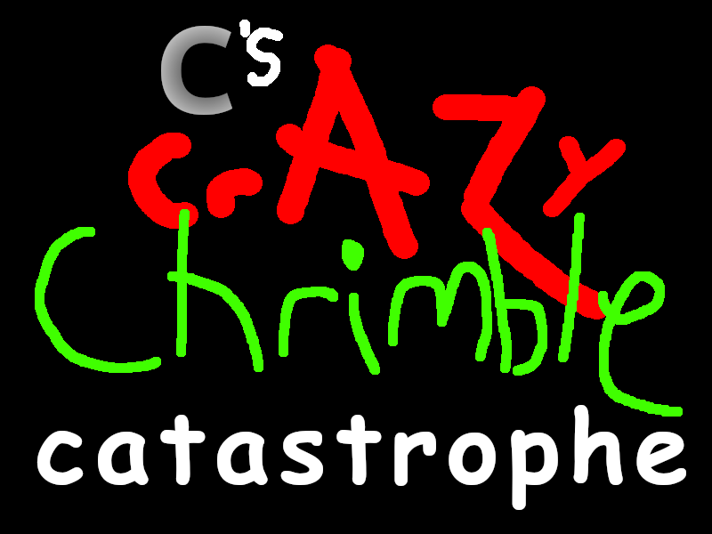

# 

a christmas adventure game, and a heartfelt expression of Me [(Commenter25)](https://commenter.cc), with about 40 minutes of content. made with pure html + css + javascript, two months of hyperfocus separated by a year, and magical duct tape holding it all together

browsing this repo will inevitably introduce you to some spoilers. you should 100% the game first. you'll have seen everything when all the ending slots are green, and...

  
full completion hint (very minor spoiler)

  you've followed the instructions of the red text after murdering. you should get all the other endings first

## 🎮 Playing
the game is hosted on https://chrimble.commenter.cc

this repository is also an entirely self-contained copy of the game. you can just download it, open index.html, and play! though i highly recommend using [firefox](https://firefox.com) in this case, as other browsers unfortunately seem to suffer audio issues

## © Licenses
All code is under the MIT license. This project includes a stripped down version of [Gapless5](https://github.com/regosen/Gapless-5) by Regaip Sen, which is also under MIT.

## 🤝 Contributing (or rather, not doing so)
To be honest, I would much prefer you don't make a pull request. I can't stop you, literally, GitHub doesn't have an option to disable them. But there's an extremely low chance I'll accept them, even if it's the smallest thing. It's a weird selfish thing, but this project is an expression of me, and I consider the code to be just the same. Every issue with it is something I solved in my own weird way. Every line of code was a learning experience for me in some way. I started this project knowing nothing about JavaScript whatsoever, and I ended with what it is now. Everything is a decision I made. Everything was done *my way.* This game is very intertwined with who I am, and I need it to stay that way.

If you find an issue, please do leave an issue or let me know about it in some way! But I ask that you let me fix it myself. I need to learn how to do it myself. It needs to be my hands on this project. This is too personal to me to let it... not be mine, if that makes sense.
